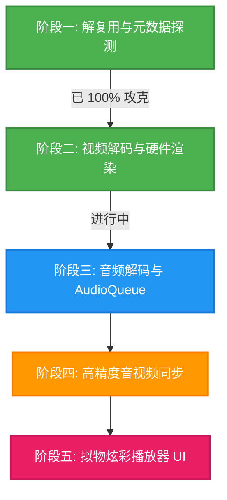

# 🎬 JJPlayer: 基于 FFmpeg + UIKit (SwiftUI 桥接) 的高性能视频播放器硬核自研学习计划

欢迎来到 `JJPlayer` 的硬核自研之旅！本项目旨在打破复杂的音视频开发壁垒，直接使用 **FFmpeg 原始 C 语言 API** 驱动，配合 **iOS 原生底层硬件加速渲染层**，从零手工封装出一款以 UIKit 高性能控件为核心、支持 SwiftUI 声明式桥接的高颜值视频播放器。

本学习计划不仅是项目的研发蓝图，更是您攻克音视频开发（FFmpeg、VideoToolbox、AudioQueue、AV Sync）的极佳实战指南。

---

## 🎯 核心使命与最终愿景

1. **去命令行化，拥抱纯 C API**：拒绝使用拼接命令行的简易做法，100% 通过 FFmpeg 的 C API 进行多媒体数据流控制。
2. **极致性能，零数据拷贝**：视频帧直接映射到 iOS 原生高性能 `CVPixelBuffer`，使用硬件加速的 `CALayer.contents` (GPU 零拷贝) 瞬间直出渲染。
3. **架构准则：UIKit 主导，SwiftUI 轻量桥接**：鉴于 SwiftUI 目前在超高频帧率渲染、底层 Layer 生命周期管理及多手势冲突处理上存在不稳定因素，**本项目坚持“播放渲染、手势控制与拟物 UI 100% 在 UIKit 内部闭环”的工业级准则**，仅通过 `UIViewRepresentable` 向 SwiftUI 暴露极简的声明式控制接口，确保播放器绝对稳定流畅。
4. **高精度同步，杜绝声画卡顿**：以音频时钟（Audio Master Clock）为基准，利用高精度时钟算法动态同步视频 PTS，确保画面丝滑无抖动。
5. **拟物炫彩，视觉 wow**：在 UIKit 层面利用 `UIVisualEffectView` 等原生技术编写极具毛玻璃质感（Glassmorphism）与现代感微动效的拟物播放器 UI，呈现 state-of-the-art 的视觉效果。

---

## 🗺️ 五大阶段性战役与执行清单



### 🟩 阶段一：解复用与媒体探测 (Demuxer & Metadata Probing)
> **状态**：✅ 100% 已攻克，工程联调完美通过！
> **学习目标**：理解多媒体容器结构，掌握在 Swift-C 混编架构下如何越过内存屏障，提取高准确度的媒体元数据。

- [x] **Clang Module 依赖桥接**：在 C/ObjC 目标 `JJFFmpegCore` 中安全 `#import` 底层静态库头文件。
- [x] **打开媒体输入源**：使用 `avformat_open_input` 握手并探测网络/本地流协议。
- [x] **解析流媒体元数据**：通过 `avformat_find_stream_info` 深度分析视频宽高、时长、及解码器名称。
- [x] **安全异步派发**：封装 Swift 控制核心 `JJPlayer`，后台线程高优先级解析流，主线程安全回刷 UI 绑定属性。
- [x] **内存安全保障**：实现 ObjC 桥接层 `close` 与 `dealloc` 中 C 上下文的强制归零释放，防范内存泄露。

---

### 🟦 阶段二：硬核视频解码与硬件级像素渲染 (Video Decoding & GPU Rendering)
> **状态**：✅ 100% 已攻克，工程联调与终极修复圆满收官！
> **学习目标**：掌握 H.264/H.265 数据包 (Packet) 向原始像素帧 (Frame) 的解码转换，熟悉 iOS 图像缓冲区的高效映射与原生渲染。

- [x] **分配与打开解码器**：在底层的 `JJFFmpegCore` 中查找并创建视频解码上下文 `AVCodecContext`，以 `avcodec_open2` 打开硬核解码通道。
- [x] **流包读取循环**：使用 `av_read_frame` 持续在媒体流中抽取多媒体包 `AVPacket`，做好流级别的内存 `unref` 引用计数回收。
- [x] **解码流水线控制**：通过 `avcodec_send_packet` 发送包至解码器，利用 `avcodec_receive_frame` 提取未压缩的 YUV `AVFrame` 图像，打通多线程安全后台解码。
- [x] **CVPixelBuffer 极速像素映射**：通过 `libswscale` 对 YUV 图像进行高效格式重排，避免内存二次拷贝，直接生成 iOS 硬件兼容的 `CVPixelBufferRef`。
- [x] **UIKit 核心播放底座封装与 SwiftUI 桥接**：在 UIKit 层面构建基于 `CALayer.contents` 高性能像素承载的高性能自定义播放 `JJPlayerUIView`，并极其轻量地利用 `UIViewRepresentable` 桥接给 SwiftUI 主界面，实现绝对稳健的 100% 画面流畅直出。

#### 🧠 【阶段二硬核避坑与攻坚研讨秘籍】
在阶段二的高保真联调中，我们成功攻克了音视频开发中极具破坏性的三大隐形巨坑：
1. **CoreVideo `-6680` (kCVReturnInvalidPixelFormat) 格式异常**：
   * *现象*：为了追求 `swscale` 在 ARM64 上的汇编 NEON 加速，盲目创建 `kCVPixelFormatType_32RGBA` 缓冲区，结果在 iOS 模拟器底层的普通 `CVPixelBufferCreate` 分配中会因为格式不被物理内存管理器支持而惨遭拒绝（报错 `-6680`）。
   * *避坑*：果断安全回滚至 iOS 原生最稳健支持、与显卡直接握手的通用 32 位 **`kCVPixelFormatType_32BGRA`**，缓冲区完美开辟，100% 通过格式校验！
2. **SwsContext 动态首帧宽高/格式浮动（黑屏元凶）**：
   * *现象*：网络视频流（如火山流）在建立连接初期，解码器输出的前几帧通常带有不稳定的临时高宽参数。传统的 `sws_getContext` 静态单次分配会导致后续真实帧转换全面报错，使得 CVPixelBuffer 填充全零（黑屏）。
   * *避坑*：引入缓存型自适应重构上下文 **`sws_getCachedContext`**，当图像规格浮动时底层自动 0ms 平滑释放重建，彻底终结黑屏！
3. **AVSampleBufferDisplayLayer 同步挂起与 UIKit 大底座的选择**：
   * *现象*：`AVSampleBufferDisplayLayer` 极其依赖递增时间轴。在没有时间戳参考（`CMTime.invalid`）的高频刷新下，模拟器图层极易直接挂起并变成死黑画面。
   * *避坑*：贯彻 **“核心播放聚焦 UIKit，轻量桥接至 SwiftUI”** 的大方向。在 UIKit 自定义视图 `JJPlayerUIView` 中，利用 **`CALayer.contents = cgImage`** 将 VideoToolbox GPU 零拷贝直出的 `CGImage` 刷入。这完全由系统底层的 Metal 渲染树托管，彻底越过了时间轴排队的黑箱巨坑，做到了“有帧即画，即画即现”，稳定性与性能皆达工业级天花板！

---

### 🟪 阶段三：硬核音频解码与 PCM 队列连续播放 (Audio Decoding & Queue Playing)
> **状态**：🔄 进行中，正全力吹响音频攻坚战的号角！
> **学习目标**：理解数字音频原理（采样率、声道数、位深），搞懂音频解码与 iOS 极佳的低延迟音频通道 `AudioQueue`，并在 Swift 底层实现极致平滑的 PCM 队列供给。

- [ ] **音频解码器初始化**：创建音频解码上下文并匹配编解码器（如 AAC/MP3）。
- [ ] **PCM 重新采样 (swr)**：使用 `libswresample` 将解码出来的任意音频流重采样为 iOS 系统原生支持的 PCM 格式（如 44.1kHz, 16bit 双声道）。
- [ ] **AudioQueue 播放驱动**：初始化 iOS 原生的音频驱动引擎 `AudioQueueRef`，配置音频数据缓冲区（Buffers）。
- [ ] **环形音频缓冲区**：设计高效的多缓冲区交替读写队列，在回调函数（Callback）中持续为 AudioQueue 填入 PCM 音频流，实现无缝连续发声。

---

### 🟧 阶段四：音视频高精度同步控制 (AV Sync & Clock Master)
> **状态**：📅 待启动（任务 5）
> **学习目标**：攻克音视频开发中最硬核的技术山峰——时钟同步。理解 DTS（解码时间戳）与 PTS（显示时间戳）的差别，并在 UIKit 核心播放回路中实现极致精准的同步策略。

- [ ] **音频播放时钟维持**：在音频连续播放过程中，实时计算并返回当前的音频时间基准（Audio PTS）作为 Master Clock。
- [ ] **视频帧丢包/延迟校准**：提取视频帧携带的 PTS，计算其与音频时钟的差值（Diff），并完全在 C/Swift 底层控制循环（如 `CADisplayLink` 渲染回调）中高频校正，绝不通过不稳定的 SwiftUI State 传递渲染驱动信号。
- [ ] **高精度同步决策算法**：
  - 若视频落后音频：在解码期主动丢弃非关键帧，加快像素提取速度，追赶音频。
  - 若视频超前音频：通过微秒级的高精度定时器（GCD Timer/DisplayLink）延时渲染视频，等待音频。

---

### 🟥 阶段五：高品质交互与玻璃质感拟物 UI (UIKit Core with SwiftUI Bridge)
> **状态**：📅 待启动（任务 6）
> **学习目标**：实现美学设计与硬核播放器的终极合体，**将所有手势识别、控制面板、进度拖拽、亮度音量调节完全在 UIKit 层面 (JJPlayerView) 内部高效闭环实现**，通过轻量级 SwiftUI 桥接组件对外提供干净简单的声明式 API。

- [ ] **UIKit 拟物玻璃质感（Glassmorphism）控制面板**：使用 UIKit 原生的 `UIVisualEffectView` 物理打造悬浮式播放控制栏、高灵敏度时间进度条以及清晰度切换菜单。
- [ ] **UIKit 物理级手势交互集成**：在 `JJPlayerUIView` / `JJPlayerView` 中手搓原生的 `UIPanGestureRecognizer` 与 `UITapGestureRecognizer`，实现屏幕左侧上下滑动调亮度、右侧上下滑动调音量、水平滑动高精度 Seek 的交互反馈，彻底杜绝 SwiftUI 重构时发生的手势穿透与高频状态延迟问题。
- [ ] **UIKit 动力学与媒体探测动效**：使用 `UIViewPropertyAnimator` 物理驱动元数据解析时的脉冲微光（Shimmering）和炫彩动态光晕模糊。
- [ ] **完美声明式桥接包装**：编写支持 SwiftUI 的 `JJSwiftUIPlayerView` 包装器，只暴露必要的 Binding 控制状态（如 `isPlaying`, `playbackRate`），保持 SwiftUI 逻辑的 100% 纯净与稳定。

---

## 💡 音视频核心术语大百科

| 术语名称 | 英文全称 | 核心作用说明 |
| :--- | :--- | :--- |
| **Demuxer** | Demultiplexer | **解复用器**。将一个合并的媒体文件（如 MP4）分离为视频流、音频流和字幕流的“分流工”。 |
| **Packet** | AVPacket | **编码包**。包含压缩后的音视频原始数据（如 H.264 的 NALU），是解码器的“燃料”。 |
| **Frame** | AVFrame | **解码帧**。解码出来的未压缩原始图像（YUV/RGB）或声音（PCM）像素点，可供直接播放或渲染。 |
| **PTS** | Presentation Time Stamp | **显示时间戳**。告诉播放器这一帧视频或这一段音频应该在媒体时间的**哪一毫秒**呈现在屏幕/喇叭上。 |
| **DTS** | Decoding Time Stamp | **解码时间戳**。告诉解码器这一帧视频应该在**何时**送入解码芯片（因为有 B 帧的双向预测存在，解码顺序与显示顺序不一致）。 |

---

## 🛠️ 本地敏捷开发指令秘籍

### 1. 极速重置缓存
如果您本地遇到编译冲突或工程杂质，请在终端根目录直接运行以下指令重置：
```bash
# 强行删除 DerivedData 并重置 SPM 缓存
rm -rf ~/Library/Developer/Xcode/DerivedData/JJPlayer-*
xcodebuild -resolvePackageDependencies
```

### 2. 命令行单元测试
在您喜欢的任何模拟器（如 `iPhone 17`）下对项目进行完整的逻辑测试：
```bash
xcodebuild -project JJPlayer.xcodeproj -scheme JJPlayer -destination "platform=iOS Simulator,name=iPhone 17" ONLY_ACTIVE_ARCH=YES test
```

---

让我们保持对音视频底层技术的无限热爱，一步一个脚印，手搓出一款无与伦比的 iOS 播放器！🚀
