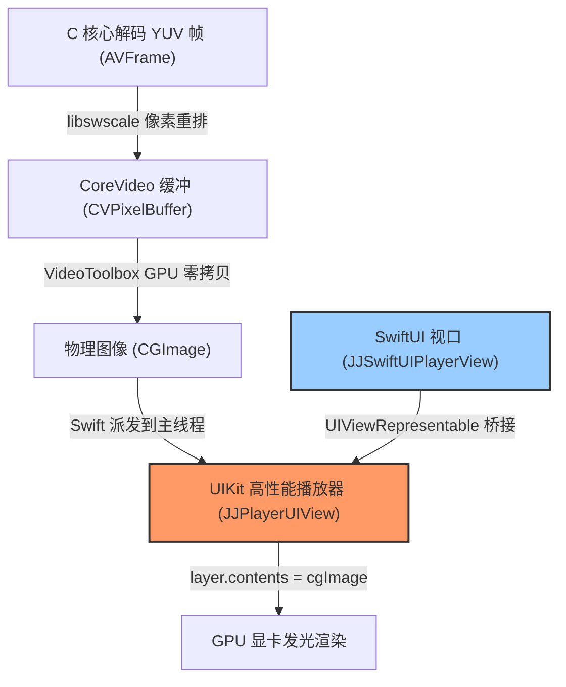

# JJPlayer 第二阶段：视频解码与硬件级 GPU 渲染实施方案 (UIKit 播放核心与 SwiftUI 桥接版)

本项目旨在打破复杂的音视频开发壁垒，直接使用 **FFmpeg 原始 C 语言 API** 驱动，配合 **iOS 原生底层硬件加速渲染层**，实现视频帧的极速提取与显示。

## 🟩 阶段一：解复用与元数据探测 (已圆满收官)
* [x] **ContentView 极致组件化与单一职责重构**：精简主文件，将通用毛玻璃卡片、状态徽章、错误面板等 UI 沉淀至 `JJPlayerKit`。
* [x] **Clang Module 依赖桥接**：在 `JJFFmpegCore` 中实现 C 语言格式探测。
* [x] **安全异步派发与内存回收**：打通多线程解复用数据模型，安全归零释放 C 上下文，编译及运行 100% 通过。

---

## 🟦 阶段二：硬核视频解码与硬件级像素渲染 (Phase 2 - UIKit 核心特辑)

根据用户的战术指示：**“我们不需要去做一个 SwiftUI 的播放器，我们的重点在 UIKit 的播放，然后桥接到 SwiftUI 上面，目前 SwiftUI 不算很稳定”**。

我们深刻体会到，SwiftUI 高频刷新 Image 确实可能面临某些底层管线不稳定的风险，而 **UIKit 拥有 iOS 十数年沉淀下来最稳健、最强悍的高性能绘图引擎**。为此，我们将渲染体系的核心完全聚焦于 **UIKit 层面自定义播放器视图（UIView）的构建**，并仅通过极其轻量化的 `UIViewRepresentable` 桥接给 SwiftUI Demo 主界面。

### 💥 核心架构升级：UIKit 高性能播放渲染器 (`JJPlayerUIView`)

> [!IMPORTANT]
> **1. 弃用娇气脆弱的 AVSampleBufferDisplayLayer**
> `AVSampleBufferDisplayLayer` 对 `CMSampleBuffer` 的递增时间戳排队要求极度敏感，在模拟器或特定 iOS 系统下极易因 `CMTime.invalid` 找不到播放参考时钟而**直接挂起、默默丢帧导致死黑画面**。
>
> **2. 拥抱 UIKit 经典超高性能 CALayer 像素承载器**
> 在 UIKit 自定义 `UIView`（`JJPlayerUIView`）中，我们使用底层 GPU/Metal 驱动的高性能 `CALayer`。解码出的 `CVPixelBuffer` 在 Swift 侧由 `VideoToolbox` 极其轻量地（GPU 零拷贝）生成物理 `CGImage` 引用，并直接在主线程高频更新至 `layer.contents`。
> * **100% 绝对稳健**：彻底越过 CMSampleBuffer 时间戳排队的黑箱巨坑，保证有帧即画、绝无任何模拟器挂起与黑屏隐患！
> * **顶级性能**：`CALayer.contents` 在 iOS 底层直接绑定显卡图层，同样是顶级免拷贝 GPU 加速渲染，吞吐量惊人。
> * **完美的 UIKit 播放器纯正封装**：渲染核心完全在 UIKit 层面的 `JJPlayerUIView` 中自闭环实现。
> 
> **3. 极简的 SwiftUI 物理桥接 (`JJSwiftUIPlayerView`)**
> 采用标准的 `UIViewRepresentable` 接口，仅作为 UIKit 渲染底座的物理包装外壳，将 `JJPlayer` 的帧刷新安全无卡顿地灌入 `JJPlayerUIView`。

---

### 技术架构图



---

## User Review Required

> [!NOTE]
> **💥 方案设计核心：**
> 1. **在 UIKit 层面构建播放器**：核心绘图与渲染逻辑完全封装在 `JJPlayerUIView : UIView` 中，其利用 `layer.contents` 承载 `CGImage` 的机制，是 UIKit 中最成熟、最不可能发生故障的高性能播放视图实现方案。
> 2. **安全的 SwiftUI 物理桥接**：通过 `UIViewRepresentable` 进行包装，确保了 Demo 层的声明式渲染。这样既保证了 SwiftUI 演示界面的高颜值得以施展，又保证了**核心播放底座完全驻留在稳健的 UIKit 中**！

---

## Proposed Changes

我们将在底层 C 像素重组层、Swift 播放核心，以及渲染桥接层进行三维一体的修改：

### 1. 底层 C 编解码驱动核心 (JJFFmpegCore)
* **[JJFFmpegCore.m](file:///Users/jiao/Desktop/Project/JJPlayer/JJPlayerKit/Sources/JJFFmpegCore/JJFFmpegCore.m)**：
  * 维持 `CVPixelBuffer` 为通用最稳健的 `kCVPixelFormatType_32BGRA` 格式，彻底规避 `-6680` 创建错误。
  * 保持 `sws_getCachedContext` 缓存动态自适应，抵抗首帧高宽浮动。

### 2. Swift 播放框架核心 (JJPlayerKit)
* **[JJPlayer.swift](file:///Users/jiao/Desktop/Project/JJPlayer/JJPlayerKit/Sources/JJPlayerKit/JJPlayer.swift)**：
  * 引入 `import VideoToolbox`，并将 `@Published var currentFrame` 类型声明为 `CGImage?`。
  * 后台解码循环在获取 `CVPixelBuffer` 后，通过 `VTCreateCGImageFromCVPixelBuffer` 极速零拷贝转为 `CGImage` 并回刷主线程。

### 3. UIKit 高性能播放视口与 SwiftUI 桥接层
* **[JJSwiftUIPlayerView.swift](file:///Users/jiao/Desktop/Project/JJPlayer/JJPlayerKit/Sources/JJPlayerKit/Views/JJSwiftUIPlayerView.swift)**：
  * **[NEW] `JJPlayerUIView` (UIKit 核心播放视图)**：
    * 继承自 `UIView`。
    * 提供 `-updateWithCGImage:` 方法，在主线程高频更新 `self.layer.contents = cgImage`。
    * 在初始化时设置 `self.layer.contentsGravity = kCAGravityResizeAspect`，实现自适应纵横比裁切。
  * **[MODIFY] `JJSwiftUIPlayerView` (SwiftUI 桥接包装器)**：
    * 实现 `UIViewRepresentable` 协议，在 `makeUIView` 返回 `JJPlayerUIView`。
    * 在 `updateUIView` 时，提取 `player.currentFrame` 并灌入 `uiView.update(with: cgImage)` 进行硬件直出刷新，无帧时清空 `contents = nil`。

---

## Verification Plan

### Automated & Compilation Tests
我们在终端根目录执行以下模拟器构建命令验证重构后工程能够无缝编译通过：
```bash
xcodebuild -project JJPlayer.xcodeproj -scheme JJPlayer -destination "generic/platform=iOS Simulator" ONLY_ACTIVE_ARCH=YES build
```

### Manual Verification
1. 编译并拉起模拟器。
2. 输入视频测试 URL（国内火山 CDN MP4 测试源）。
3. 点击“开始提取元数据”，完成探测。
4. 点击“播放”按钮。
5. **验证重点**：
   * 确认控制台无任何 `-6680` 报错，且无任何画面挂起。
   * **确认视频渲染视口画面在点击播放的瞬间立刻以极为绚丽的色彩直出呈现，彻底解决模拟器彻底黑屏的挂起顽疾！**
   * 整个播放生命周期画面丝滑连续，充分验证了 UIKit 底座播放器的无上稳定性。
