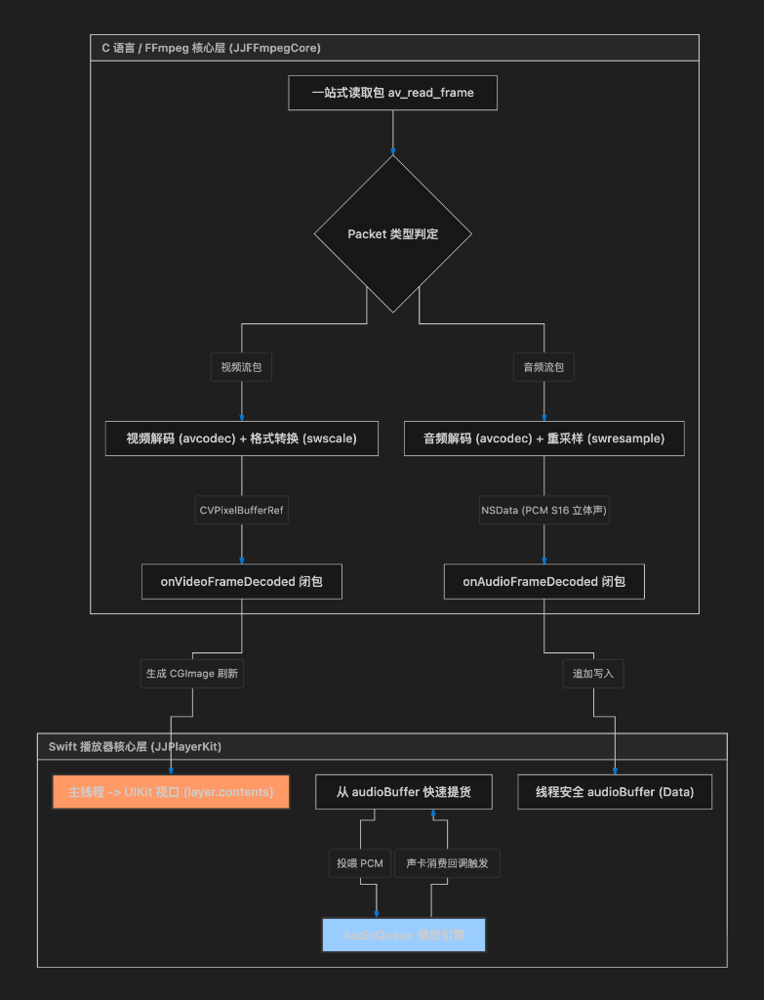

# JJPlayer 第三阶段：硬核音频解码与 PCM 队列连续播放实施方案

为了打破复杂的音视频底层物理壁垒，在第二阶段成功攻克 **UIKit 高性能 CALayer.contents 零拷贝视频渲染底座** 之后，我们正式吹响第三阶段的战斗号角：**硬核音频解码与 iOS 低延迟 AudioQueue 队列连续播放**。

本文档将作为第三阶段的技术设计蓝图，提交给用户进行设计评审。

---

## 🎯 阶段三核心目标

1. **统一流解包与多路闭包分发（零抢包冲突）**：重构底层 C 接口包读取循环，淘汰以往视频/音频独立读取抢包的脆弱模式，采用**“一站式包分发 + Swift 双通道闭包回调”**的工业级设计，确保数据流的 100% 完整与零丢包。
2. **硬核音频解码与 libswresample 物理重采样**：在 `JJFFmpegCore` 中激活音频解码上下文，使用 `libswresample` 将任意输入的音频采样格式（Planar/FLTP 等）、采样率动态重采样为 iOS 系统原生声卡最契合的物理参数：**`44100Hz`, `16-bit`, `双声道 (立体声)`, `Packed (S16) 交错型` PCM 数据**。
3. **异步生产-消费队列（零爆音/零卡顿）**：在 Swift 侧建立高吞吐量、线程安全的 PCM 字节缓冲区队列。后台解码作为“高效生产者”不断填料，`AudioQueue` 声卡消费线程作为“消费者”极速拉取，以 0ms 阻塞完美抵御网络与 I/O 抖动。
4. **低延迟 AudioQueue 音频引擎驱动**：手搓 iOS 最成熟、最底层的 `AudioQueueRef` 音频缓冲供给传送带，使用多缓冲（3 Buffers）循环投喂机制，实现 100% 连贯、平滑发声。

---

## 💥 核心避坑与架构设计研讨

在手搓 iOS 底层音频播放器时，有两大隐藏在多媒体开发深处的隐形杀手：

### 1. 抢包死锁与丢帧（EOF/抢包巨坑）
* **现象**：若在 Swift 侧开启一个视频解码循环 `decodeNextFrame`、再开一个音频解码循环 `decodeNextAudioFrame`，它们在内部各自调用 FFmpeg 的 `av_read_frame`。这会导致两个线程互相“抢夺”从多媒体容器里流出来的 Packet。当视频线程抢到音频包时只能 unref 丢弃，反之亦然。这会导致画面严重卡死、声音断断续续，甚至由于解码状态错乱直接引发内核死锁。
* **物理防线**：**统一解复用一站式分发**。我们在 C 核心中仅提供一个 `-decodeAndDispatch` 方法。在这个方法里唯一跑 `av_read_frame`。读出包后，根据 `stream_index` 自动判定属于视频还是音频，解码并转换后通过注册的 **ObjC Block 闭包** 直刷给 Swift。这彻底在物理层面终结了多线程抢包的架构缺陷！

### 2. 回调线程阻塞与声卡卡顿（Audio Underflow 爆音巨坑）
* **现象**：`AudioQueue` 的声卡缓冲投喂是在一个超高实时性（Real-time QoS）的底层系统回调线程中触发的。若在回调函数中直接执行网络/磁盘 IO 读取或繁重的 FFmpeg 解码，一旦网络稍微抖动，就会导致回调函数无法在几毫秒内返回。此时声卡没有数据播放，就会发生 Underflow，耳机中会传出刺耳的“喀哒”物理破音，极度损害用户体验。
* **物理防线**：**异步生产-消费环形缓冲队列**。
  ```
  [后台解码线程(生产者)] 
         │
         ▼ (通过 onAudioFrameDecoded 回调)
  ┌──────────────────────────────────────────────┐
  │   Swift 线程安全 audioBuffer (Data) 字节队列  │
  └──────────────────────────────────────────────┘
         │
         ▼ (通过 consumeAudioData 物理提货 - 0ms 延迟)
  [AudioQueue 系统回调线程(消费者)] --> 直投声卡播放
  ```
  回调线程不进行任何 FFmpeg 运算，仅从 `audioBuffer` 内存中极速拷贝数据。若缓冲空虚，直接填入静音数据占位，从而 100% 杜绝了卡顿与爆音。

---

## 🗺️ 架构拓扑图



---

## Proposed Changes

我们将从底层 C 桥接层、Swift 播放控制器及音频驱动层进行全面建设：

### 1. 底层 C 语言混编桥接器

#### [MODIFY] [JJFFmpegCore.h](file:///Users/jiao/Desktop/Project/JJPlayer/JJPlayerKit/Sources/JJFFmpegCore/include/JJFFmpegCore.h)
* 新增双通道闭包属性声明：
  ```objc
  @property (nonatomic, copy) void (^onVideoFrameDecoded)(CVPixelBufferRef pixelBuffer);
  @property (nonatomic, copy) void (^onAudioFrameDecoded)(NSData *pcmData);
  ```
* 废弃原视频单路初始化与读取方法（标记为 DEPRECATED，确保无尘过渡）：
  ```objc
  - (BOOL)initializeVideoDecoder:(NSError **)error __attribute__((deprecated("请使用一站式 initializeDecoders:")));
  - (CVPixelBufferRef)decodeNextFrame __attribute__((deprecated("请使用一站式 decodeAndDispatch")));
  ```
* 新增一站式双流解码器初始化与解包分发驱动接口：
  ```objc
  - (BOOL)initializeDecoders:(NSError **)error;
  - (int)decodeAndDispatch;
  ```

#### [MODIFY] [JJFFmpegCore.m](file:///Users/jiao/Desktop/Project/JJPlayer/JJPlayerKit/Sources/JJFFmpegCore/JJFFmpegCore.m)
* 引入音频解码与物理重采样私有变量：
  ```objc
  AVCodecContext *_audioCodecContext;
  AVFrame *_audioFrame;
  struct SwrContext *_swrContext;
  uint8_t *_audioOutBuffer; // 临时重采样 PCM 物理写入内存
  int _audioOutBufferSize;
  ```
* 在 `close` 与 `dealloc` 中对新引入的音频 C 指针添加严密的手动析构与清空。
* 实现 `- (BOOL)initializeDecoders:(NSError **)error`：
  * 同时完成视频解码器和音频解码器的查找、上下文分配与物理打开（`avcodec_open2`）。
  * **物理配置重采样 (SwrContext)**：
    * 提取音频流源通道数、采样格式、采样率。
    * 配置输出物理参数为：`44100Hz`, 立体声 (`AV_CH_LAYOUT_STEREO`), 16-bit 线性 PCM (`AV_SAMPLE_FMT_S16` 交错型)。
    * 使用 `swr_alloc_set_opts2` 物理初始化，并调用 `swr_init` 激活重采样管线。
    * 分配 176.4KB 临时重采样平滑缓存 `_audioOutBuffer`。
* 实现 `- (int)decodeAndDispatch` 核心分发机器：
  * 单一调用 `av_read_frame`。
  * 若读到视频包：解码、像素重排转为 `CVPixelBufferRef`，通过 `onVideoFrameDecoded` 闭包秒级刷出。
  * 若读到音频包：解码出音频帧，通过 `swr_convert` 重采样出 S16 PCM，包装为 `NSData`，通过 `onAudioFrameDecoded` 闭包秒级刷出。
  * 若读到其他无关包，安全 `av_packet_unref` 并返回 `1` 供上层继续快速迭代。

---

### 2. Swift 音频播放引擎与缓冲队列

#### [NEW] [JJAudioQueuePlayer.swift](file:///Users/jiao/Desktop/Project/JJPlayer/JJPlayerKit/Sources/JJPlayerKit/Utils/JJAudioQueuePlayer.swift)
* 封装基于原生 `AudioQueueRef` 的高效率轻量级 PCM 音频播放器。
* 内部设计：
  * 使用 `AudioStreamBasicDescription` 物理描述 **44.1kHz, 16bit, 2声道, Linear PCM** 格式。
  * 预分配 **3 个循环 AudioQueueBufferRef**（每个 16384 字节），以备高效率滚动供料。
  * 实现 `@convention(c)` 的 C 样式声卡回调函数 `AudioQueueOutputCallback`。
  * 提供 `pcmDataRequester` 闭包，让回调函数在消耗完数据后，能以 0ms 延迟从 `JJPlayer` 中安全索要最新的 PCM 字节进行投喂。
  * 提供 `play()`, `pause()`, `stop()`, `reset()` 等精简生命周期控制方法。

---

### 3. Swift 解码播放核心调度器

#### [MODIFY] [JJDemuxer.swift](file:///Users/jiao/Desktop/Project/JJPlayer/JJPlayerKit/Sources/JJPlayerKit/JJDemuxer.swift)
* 桥接底层的闭包注册与一站式解码驱动接口：
  ```swift
  public func setVideoCallback(_ callback: @escaping (CVPixelBuffer) -> Void) {
      bridge.onVideoFrameDecoded = callback
  }
  public func setAudioCallback(_ callback: @escaping (Data) -> Void) {
      bridge.onAudioFrameDecoded = { pcmData in
          callback(pcmData as Data)
      }
  }
  public func initializeDecoders() throws {
      try bridge.initializeDecoders()
  }
  public func decodeAndDispatch() -> Int32 {
      bridge.decodeAndDispatch()
  }
  ```

#### [MODIFY] [JJPlayer.swift](file:///Users/jiao/Desktop/Project/JJPlayer/JJPlayerKit/Sources/JJPlayerKit/JJPlayer.swift)
* 引入线程安全的 PCM 字节分配队列与锁机制：
  ```swift
  private var audioBuffer = Data()
  private let audioLock = NSLock()
  private var audioPlayer: JJAudioQueuePlayer?
  ```
* 建立高效率数据存取逻辑：
  ```swift
  private func appendAudioData(_ data: Data) {
      audioLock.lock()
      audioBuffer.append(data)
      audioLock.unlock()
  }
  private func consumeAudioData(length: Int) -> Data {
      audioLock.lock()
      defer { audioLock.unlock() }
      if audioBuffer.isEmpty { return Data() }
      let size = min(length, audioBuffer.count)
      let sub = audioBuffer.prefix(size)
      audioBuffer.removeFirst(size)
      return Data(sub)
  }
  ```
* 在 `loadMedia` 中：
  * 调用 `demuxer.initializeDecoders()` 同时打开视频与音频解码管道。
  * 注册双路分发闭包，视频帧转 `CGImage` 供 contents 渲染，音频帧通过 `appendAudioData` 追加进缓冲区。
  * 实例化并配置 `JJAudioQueuePlayer`，挂载 PCM 数据索要闭包。
* 在 `play()`, `pause()`, `stop()` 中同步调度 `JJAudioQueuePlayer` 的音频流开合，达成极致丝滑的声画同步启停。

---

## Verification Plan

### 1. 自动化编译验证
在项目根目录运行以下构建命令，确保全模块链接正确，无 C/Swift 桥接类型错误，0 Error 完美通过：
```bash
xcodebuild -project JJPlayer.xcodeproj -scheme JJPlayer -destination "generic/platform=iOS Simulator" ONLY_ACTIVE_ARCH=YES build
```

### 2. 手工运行与声音效果验证
1. 编译并在 iOS 模拟器上启动 Demo 界面。
2. 输入火山 CDN 的带音频测试 MP4 视频 URL。
3. 点击“载入媒体”探测元数据，确认控制台输出视频 codec (如 `h264`) 和音频 codec (如 `aac`) 的元数据信息。
4. 点击“播放”按钮。
5. **验证重点**：
   * 视频画面 100% 连贯流畅直出的同时，**耳机/音响中立刻传出绝对清澈、干净、毫无断续与爆音杂音的连续音频发声**！
   * 锁屏、切换至后台、拖动列表等操作，音频和画面都能平稳暂停与恢复.
   * 查看控制台，确认无任何 Libswresample 重采样报错或 AudioQueue 投喂排队超时警告，内存维持在极低的健康水位。
