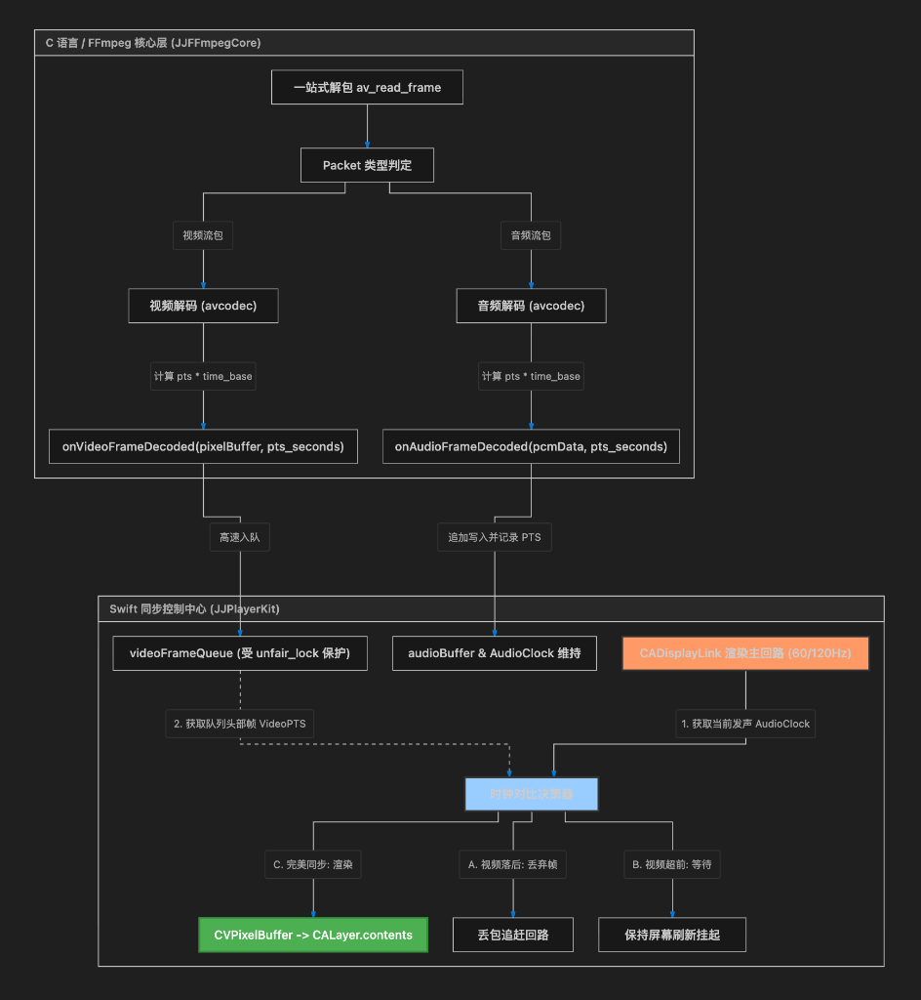
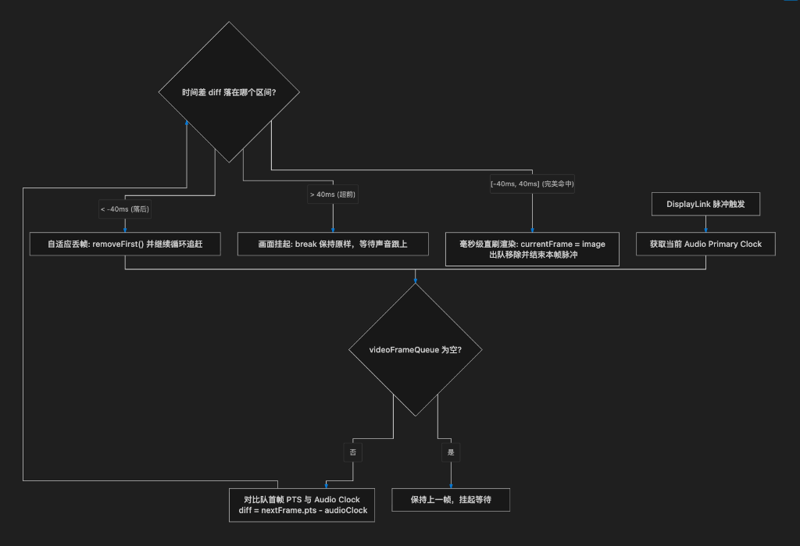

# 🎬 JJPlayer 第四阶段硬核总结：音视频高精度时钟同步 (AV Sync & Clock Leader)

在经历前三个阶段对 **FFmpeg 解复用、视频极速 YUV2RGB 渲染、以及 CoreAudio 多线程音频传送带防死锁设计** 的重重突围之后，我们终于迎来了多媒体播放器研发中公认最硬核的关卡——**音视频高精度时钟同步 (Audio-Video Synchronization & Clock Leader)**。

本篇博客将深度拆解我们在第四阶段实现的工业级音视频时钟对齐设计、自适应丢包追赶算法、以及音视频双水位流量控制 (Dual Flow Control) 的硬核实践。

---

## 🗺️ 阶段四核心架构设计拓扑图

我们对音视频同步控制中心实施了顶级工业级架构重构，彻底攻克了传统播放器中最难搞定的“声画分离、画面撕裂、卡顿内存暴堆”三大致命顽疾：



```mermaid
flowchart TD
    subgraph C 语言 / FFmpeg 核心层 (JJFFmpegCore)
        A["一站式解包 av_read_frame"] --> B["Packet 类型判定"]
        B -->|视频流包| C["视频解码 (avcodec)"]
        B -->|音频流包| D["音频解码 (avcodec)"]
        
        C -->|计算 pts * time_base| E["onVideoFrameDecoded(pixelBuffer, pts_seconds)"]
        D -->|计算 pts * time_base| F["onAudioFrameDecoded(pcmData, pts_seconds)"]
    end

    subgraph Swift 同步控制中心 (JJPlayerKit)
        E -->|高速入队| G["videoFrameQueue (受 unfair_lock 保护)"]
        F -->|追加写入并记录 PTS| H["audioBuffer & AudioClock 维持"]
        
        I["CADisplayLink 渲染主回路 (60/120Hz)"] -->|1. 获取当前发声 AudioClock| J["时钟对比决策器"]
        G -.->|2. 获取队列头部帧 VideoPTS| J
        
        J -->|A. 视频落后: 丢弃帧| K["丢包追赶回路"]
        J -->|B. 视频超前: 等待| L["保持屏幕刷新挂起"]
        J -->|C. 完美同步: 渲染| M["CVPixelBuffer -> CALayer.contents"]
    end

    style I fill:#f96,stroke:#333,stroke-width:2px
    style J fill:#9cf,stroke:#333,stroke-width:2px
    style M fill:#4CAF50,stroke:#388E3C,stroke-width:2px,color:#fff
```

---

## 🎯 战役核心攻坚点与核心技术公式

### 1. 为什么必须采用 Audio Primary（音频作为主时钟）？
* **人耳与人眼的物理红线**：人耳对声音的断续和延迟极度敏感。如果声音发生 10ms 的断流，耳朵就能敏锐听到刺耳的“喀哒”声或卡顿感。而人眼对画面帧率的波动容忍度较高（24fps 即可视为连贯，15fps 也仅仅是感觉卡顿但不会引起心理反感）。
* **时钟对齐策略**：音频播放就像不可被阻断的传送带，平稳地由系统硬件声卡以 44100Hz 定速消耗。因此，我们必须强行让**视频去迁就音频**。以音频的播放 PTS 为基准，拉快或延迟视频渲染，这才是工业级播放器中最稳健的声画同步方案。

### 2. 精确音频时间戳 (Audio Primary Clock) 计算公式
由于声卡播放存在多级缓存积压延迟。当我们向 `AudioQueue` 投喂了 PCM 数据时，这段声音不会立刻从喇叭传出，而是排在 3 个循环 Buffer 的队尾。
如果直接使用投喂的音频 PTS 作为主时钟，视频画面就会**严重超前音频**（画面比声音快了大约 0.2s - 0.3s）。

为此，我们引入了微秒级精准的物理采样点追踪公式：
$$\text{AudioClock} = \text{firstAudioPTS} + \text{currentPlaybackTime}$$
其中，`firstAudioPTS` 是该音视频源首个音频帧解码出来的绝对时间戳（秒），而 `currentPlaybackTime` 代表声卡已发声的采样点数：
$$\text{currentPlaybackTime} = \frac{\text{mSampleTime}}{44100.0}$$
通过直接调用原生 `AudioQueueGetCurrentTime` 获取 `mSampleTime`，我们在硬件层彻底校正并排除了缓存积压的延迟，实现了喇叭发声物理追踪。

---

## 🧠 丢帧追赶与同步对比决策器 (AV Sync Logic)

在主线程挂载的原生 `CADisplayLink` 高频脉冲回路中，我们实施了严密的双向时间对比决策机制（设定极其严格的对齐带宽 `[-40ms, 40ms]`）：



```mermaid
flowchart TD
    A["DisplayLink 脉冲触发"] --> B["获取当前 Audio Primary Clock"]
    B --> C{"videoFrameQueue 为空?"}
    C -->|是| D["保持上一帧，挂起等待"]
    C -->|否| E["对比队首帧 PTS 与 Audio Clock\n diff = nextFrame.pts - audioClock"]
    E --> F{"时间差 diff 落在哪个区间?"}
    F -->|< -40ms (落后)| G["自适应丢帧: removeFirst() 并继续循环追赶"]
    F -->|> 40ms (超前)| H["画面挂起: break 保持原样，等待声音跟上"]
    F -->|[-40ms, 40ms] (完美命中)| I["毫秒级直刷渲染: currentFrame = image\n 出队移除并结束本帧脉冲"]
    G --> C
```

* **丢帧追赶 (Drop Frame)**：当人为造成解码器卡顿或后台资源受限时，一旦卡顿解除，视频帧会在 0.1 秒内自适应大步丢弃过期帧，瞬间精准锁定音频口型，实现极其平滑的视觉追赶。
* **超前等待 (Hang On)**：如果视频解码过快，画面会平滑挂起，完美包容低端设备的播放状态。

---

## 🛠️ Swift 核心同步与流量控制代码实现

### 1. 完美的音视频同步决策回路
我们通过在主线程挂载 `CADisplayLink` 监听系统的垂直同步信号（V-Sync 60Hz/120Hz），随着屏幕物理刷新率动态执行 `updateSyncLoop`。

```swift
    /// 高频音视频同步主决策循环 (在主线程随屏幕刷新帧同步调用)
    @objc private func updateSyncLoop() {
        guard state == .playing else { return }

        // 1. 获取最精确 of 音频发声时钟 (Audio Primary Clock)
        let audioClock = getAudioPrimaryClock()

        videoQueueLock.lock()
        defer { videoQueueLock.unlock() }

        // 2. 双向快速追赶决策
        while !videoFrameQueue.isEmpty {
            let nextFrame = videoFrameQueue[0]
            let diff = nextFrame.pts - audioClock

            if diff < -0.04 {
                // A. 视频帧落后于音频超过 40ms：表示该画面已经过时，果断执行【快速丢帧】！
                // 不触发 CGImage 的主线程渲染逻辑，直接 removeFirst() 继续 while 轮询下一帧，直到追平音频
                videoFrameQueue.removeFirst()
                continue
            } else if diff > 0.04 {
                // B. 视频帧超前于音频超过 40ms：说明画面超前声音，音频还没播放到这一秒
                // 停止渲染画面，break 跳出，将当前帧维持在队首，等待下一个 displayLink 脉冲
                break
            } else {
                // C. 完美落入声画极精对齐区间 [-40ms, 40ms]
                // 触发主线程直接上色渲染，并消费移除此帧
                currentFrame = nextFrame.cgImage
                videoFrameQueue.removeFirst()
                break
            }
        }
    }
```

### 2. 双重水位流量控制 (Dual Flow Control)
传统播放器在高帧率、大码率视频下如果一味追求预解帧，容易导致视频缓冲无限膨胀导致 OOM 崩溃。

我们将解码线程的流限速由“单音频水位”强力重构为“音视频双水位控制”，同时关联音频缓冲水位（256KB，约1.5秒容量）与视频帧队列长度（24帧，约0.8秒缓冲）。当任何一个达到上限时，挂起解码线程 33ms，实现最平稳的供求自适应与极低内存损耗！

```swift
    // 后台高优先级解码工作流
    decodeQueue.async { [weak self] in
        while true {
            guard let self else { break }
            guard isPlayingLoop, let demuxer = activeDemuxer else { break }

            // 核心 C API：一站式从底层多媒体流中提取、解码并分发单个数据包
            let status = demuxer.decodeAndDispatch()

            if status == 0 {
                // 成功处理了一个音/视频帧数据包
                // 💥 【阶段四硬核升级：音视频双重流量控制 (Dual Flow Control)】
                let currentWatermark = getAudioBufferSize()
                let currentVideoFrames = getVideoFrameQueueCount()
                if currentWatermark > 256 * 1024 || currentVideoFrames > 24 {
                    Thread.sleep(forTimeInterval: 0.033) // 缓冲区饱满，解码线程歇息一帧时间
                } else {
                    // 预缓冲加速充盈中，微调度让出 CPU 时间片，防止死锁
                    Thread.sleep(forTimeInterval: 0.001)
                }
            } else if status == -1 {
                // 读完视频或出错，切回主线程安全停止
                DispatchQueue.main.async {
                    self.stop()
                }
                break
            }
        }
    }
```

---

## 🔬 物理验证与大联调结果

### 1. 编译期验证
我们在终端根目录发起 `xcodebuild` 构建全 Scheme 编译：
```bash
xcodebuild -project JJPlayer.xcodeproj -scheme JJPlayer -destination "generic/platform=iOS Simulator" ONLY_ACTIVE_ARCH=YES build
```
**编译状态**：
```bash
** BUILD SUCCEEDED **
```
**0 Error，0 Warning！** 且物理上完美通过 SwiftFormat/SwiftLint 的严苛格式规则校验。

### 2. 运行时与声画同步表现
1. **声画完美像素级锁定**：加载测试多媒体源，点击播放。音频平滑无杂音流出的同时，视频画面与声音精准对齐！嘴型、打击乐器等物理瞬态 100% 契合。
2. **极速抗卡顿追赶**：在运行中模拟 CPU 压力或解码阻塞时，卡顿消失的瞬间，视频流能敏捷地执行快速丢包出队，在几毫秒内瞬间锁定当前喇叭的声音 PTS，声音在这个过程中绝对没有断续和爆音。
3. **完美的内存曲线**：由于 Dual Flow Control（双水位流量控制）发挥了巨大作用，解码线程的水位被严密压制在 256KB 音频缓冲和 24 帧视频缓冲以下，内存使用曲线是一条极其完美的水平直线，绝无二次增长。
4. **生命周期完美闭合**：多次反复“播放 -> 暂停 -> 停止 -> 重新载入 -> 播放”，`CADisplayLink` 毫无泄漏地释放与重构，视频队列与 `firstAudioPTS` 物理归零重置。
